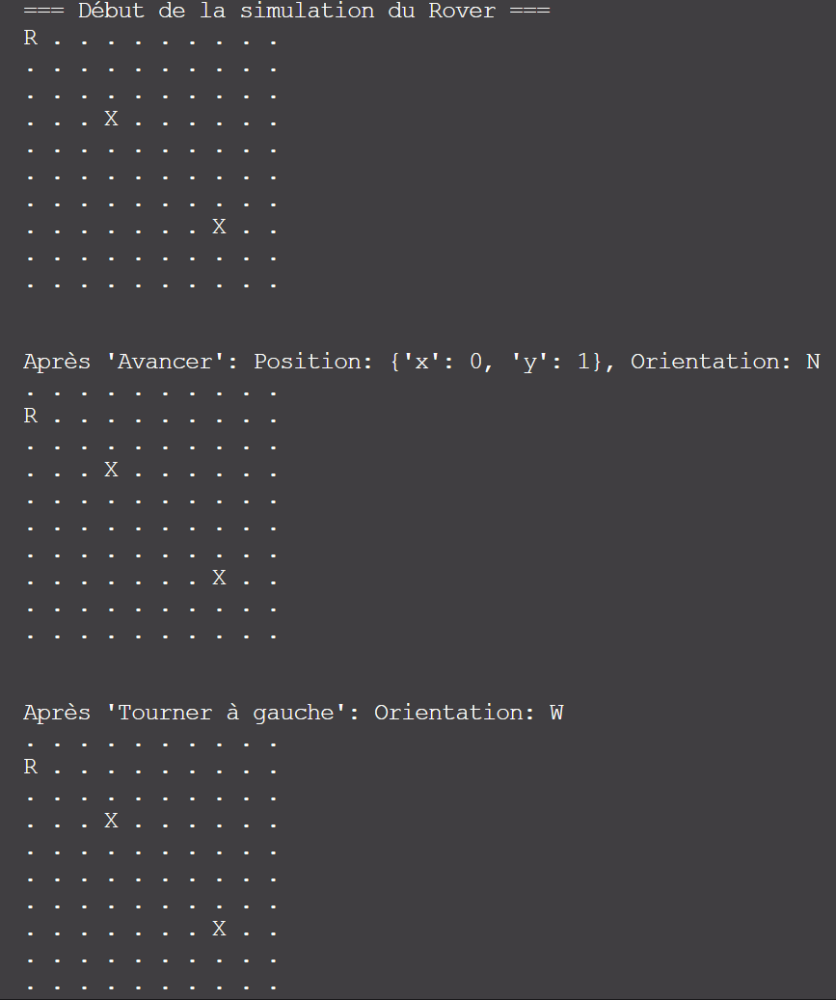

# Projet Rover

## Introduction

Ce projet a été réalisé dans le cadre du module **Architecture Logicielle** et illustre les principes fondamentaux de conception et d'organisation d'un logiciel modulaire, extensible et maintenable. Le Rover est une simulation d'un robot capable de se déplacer sur une grille toroïdale, d'éviter des obstacles, et de recevoir des commandes locales ou distantes.

Le projet met en œuvre des concepts clés comme :
- **Séparation des responsabilités** : Logique métier et présentation distinctes.
- **Architecture modulaire** : Une organisation claire des fichiers pour une meilleure lisibilité et évolutivité.
- **Tests unitaires** : Assurer la robustesse et la fiabilité du code.

---

## Equipe : 

L'équipe est composée de 4 membres : 
- DIETRICH Thomas
- EL-HANI Fadel
- FITAHIANTSOA Tiavo Christiano
- RISTICH Estéban


## Fonctionnalités

1. **Déplacement du Rover** :
   - Mouvement avant et arrière.
   - Rotation gauche et droite.
   - Gestion des bordures toroïdales (le Rover revient de l'autre côté de la grille).

2. **Gestion des obstacles** :
   - Le Rover détecte les obstacles sur son chemin et reste immobile si un obstacle est présent.

3. **Commandes distantes via Sockets** :
   - Contrôlez le Rover à distance grâce à un serveur TCP.
   - Commandes disponibles : `move_forward`, `rotate_left`, `rotate_right`, `exit`.

4. **Affichage de la grille** :
   - Visualisation en console de la position du Rover et des obstacles.

---

## Architecture

Le projet est organisé selon une architecture modulaire qui respecte les bonnes pratiques de conception logicielle :

```bash
src/
    rover_core/
        rover.py           # Logique métier du Rover (mouvements, orientation)
        planet.py          # Gestion de la grille toroïdale et des obstacles
        movement.py        # Fonction utilitaire pour gérer les rotations
    utils/
        grid_display.py    # Fonction pour afficher la grille en console
    main.py                # Point d'entrée principal du programme
tests/
    test_rover.py          # Tests unitaires pour la classe Rover
    test_planet.py         # Tests unitaires pour la classe Planet
    test_movement.py       # Tests unitaires pour les rotations
```


### **Principes d'Architecture**

1. **Séparation des responsabilités** :
   - `rover_core` : Regroupe la logique métier (Rover, grille, obstacles).
   - `utils` : Contient les fonctions utilitaires, comme l'affichage de la grille.

2. **Extensibilité** :
   - La gestion des sockets et l'affichage sont modulaires et peuvent être modifiés sans impacter la logique métier.

3. **Testabilité** :
   - Tous les modules sont accompagnés de tests unitaires pour garantir leur bon fonctionnement.

---

## Installation

1. Clonez ce dépôt :
   ```bash
   git clone <url_du_dépôt>
   cd <nom_du_dossier>
   ```

2. Créez un environnement virtuel :
    ```bash
    python -m venv venv
    source venv/bin/activate  # Sous Windows : venv\Scripts\activate
    ```
    
3. Installez les dépendances (si nécessaire) :
    ```bash
    pip install -r requirements.txt
    ```

## Utilisation

### **1. Lancer la Simulation Locale**
Pour exécuter la simulation en local, lancez le fichier principal avec la commande suivante :
```bash
python -m src.__main__
```

Exemple de sortie en console avec obstacles :



### Légende
- `R` : Représente le Rover.
- `X` : Représente un obstacle sur la grille.
- `.` : Représente une case vide.


## Tests

Des tests unitaires couvrent les principales fonctionnalités du projet :
- **Rover** : Déplacements avant/arrière, rotation, gestion des positions.
- **Planet** : Bordures toroïdales, détection des obstacles.
- **Rotations** : Fonctionnalités de rotation gauche/droite.

### Exécuter les Tests
Utilisez `pytest` pour exécuter tous les tests :
```bash
pytest

tests/test_movement.py ...                                                                          [ 33%]
tests/test_planet.py ....                                                                           [ 66%]
tests/test_rover.py .....                                                                          [100%]

================================== 9 passed in 0.15s ===================================
